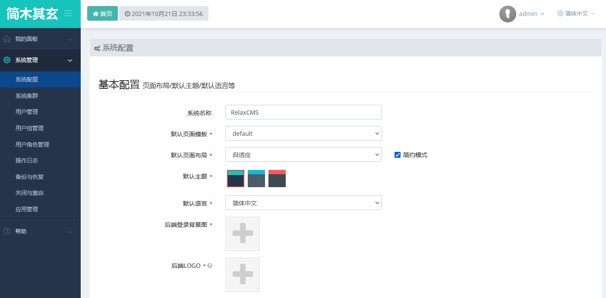
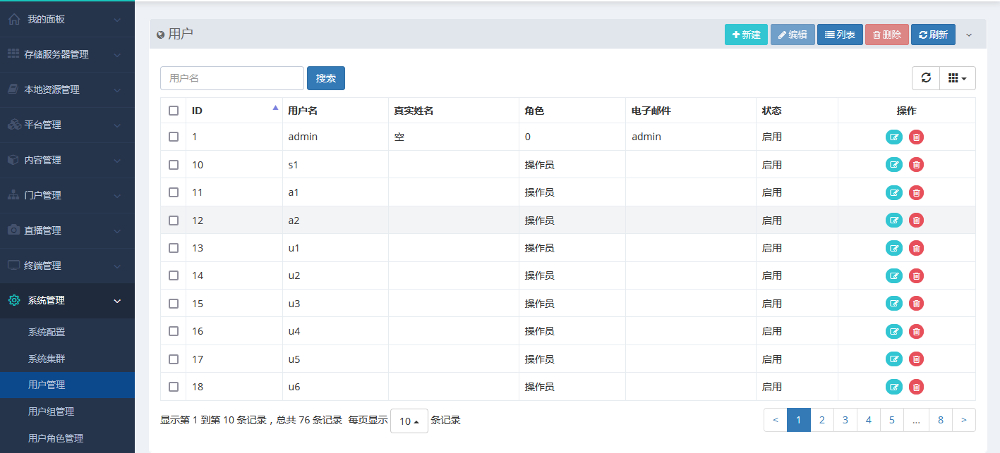
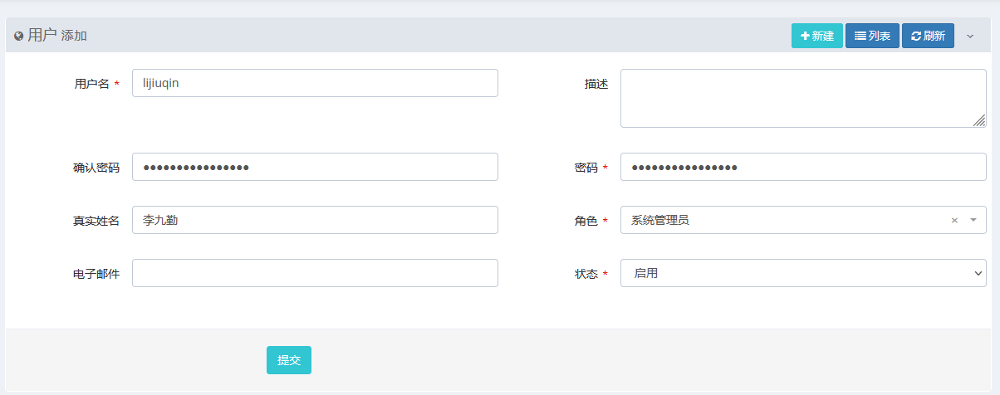
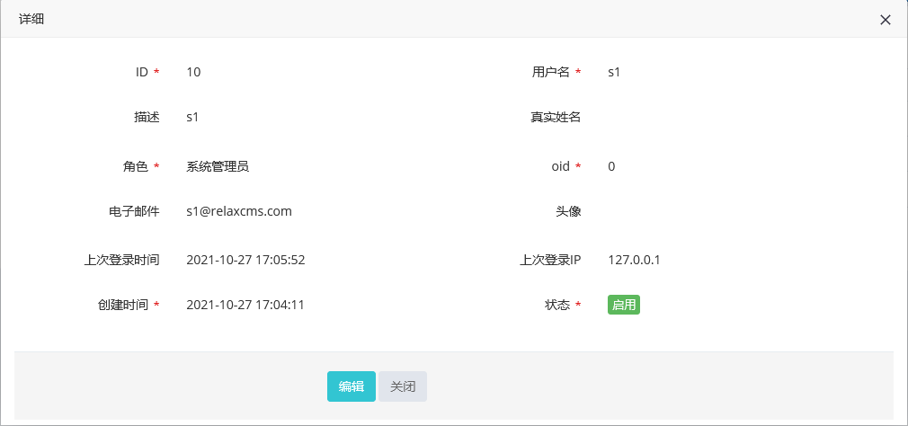
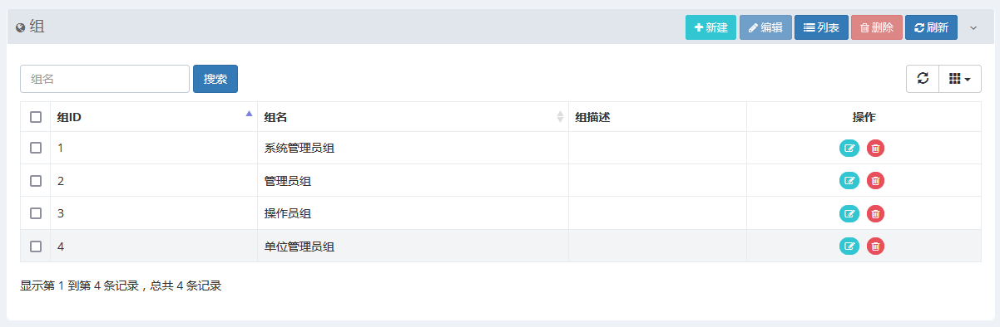
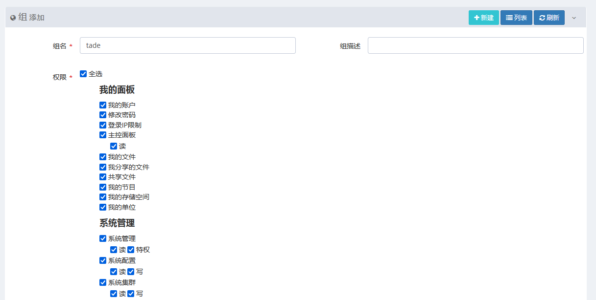
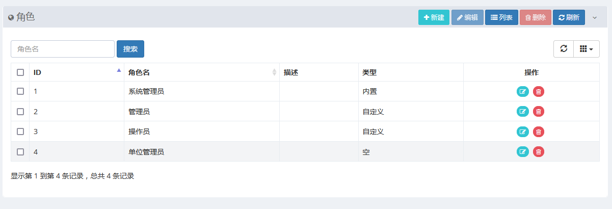
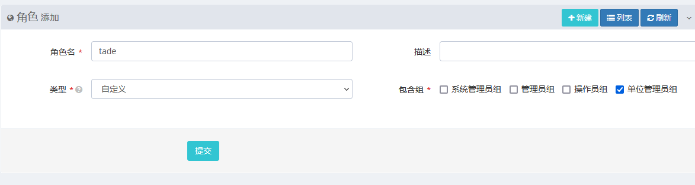
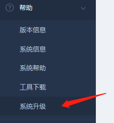
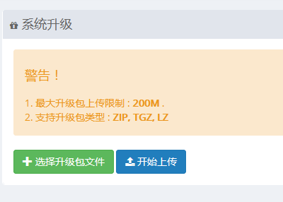

% 系统管理员手册
% 版本：7.0

前言
--------

本手册为系统管理员手册，主要介绍系统全局配置、用户管理、用户组管理、用户角色管理、系统备份、系统日志、应用安装等系统管理功能。主要阅读对象为系统管理员。

*注1：本手册内容依据版本变化将会即时修订，当手册描述与软件实现不一致时，请下载或登录系统查看与软件版本一致的最新手册。*

*注2：WEB浏览器版本必须支持H5，否则部份功能将无法使用，推存使用Firefox 60.0以上版本 *

登录
----------
使用系统管理员角色登录本系统，更多参[登录](user.html)

系统管理
----------

## 系统配置
	点击：系统管理|系统配置，如下：

	
- 系统名称：可修改，系统标识之一，浏览器页签标题中显示此字段。

- 后端模板：后端支持页面模板定制，初始为“默认”。

- 默认页面布局:实现“固定宽度”与“自适应”两种部局。

- “简约”选项：打勾启动简约UI，不打勾系统处于完整UI,完整UI显示页面导航。

- 默认主题: 支持：绿、蓝、红三种主题色，默认启用“绿”。

- 默认语言：支持“简体中文”与“English”两种语言包，默认为“简体中文”。

- 后端登录背景图: 上传本地图片可以更换系统背景图片。

- 登录验证码: 开启此选项后每一次登录系统需要输入验证码，默认开启。

- 安全码: 系统认证使用参数，变更此项后，系统缓存的登录信息将立即失效，建议定期更换以提高系统安全。

- API/API存取码：第三方应用提供存取本系统接口。

- 记忆登录：开启此选项，登录时允许浏览器记录登录信息，默认开启，高机密应用建议关闭此选项。

- 调试日志: 开发调试使用，正式运行系统，建议关闭。

- 点击“提交”保存系统配置变更。

	
	
## 系统集群

## 用户管理
### 列表
	实现新用户分页列表显示。点击：系统管理|用户管理，如下：
	

### 添加
	实现新用户创建。点击：系统管理|用户管理|新建，如下：

	
### 修改
	实现用户修改。点击：系统管理|用户管理，选中一行点击“编辑”或点“操作列”“编辑”。

### 删除
	实现用户删除。点击：系统管理|用户管理，选中一行点击“删除”或点“操作列”“删除”。

## 详细
- 双击一行，显示详细：

## 用户组管理
### 列表
	实现新用户组分页列表显示。点击：系统管理|用户组管理，如下：

### 添加
	实现新用户组创建。点击：系统管理|用户组管理|新建，如下：

	
### 修改
	实现用户组修改。点击：系统管理|用户组管理，选中一行点击“编辑”或点“操作列”“编辑”。

### 删除
	实现用户组删除。点击：系统管理|用户组管理，选中一行点击“删除”或点“操作列”“删除”。

## 用户角色管理
### 列表
	实现新用户角色分页列表显示。点击：系统管理|用户角色管理，如下：

### 添加
	实现新用户角色创建。点击：系统管理|用户角色管理|新建，如下：

	
### 修改
	实现用户角色修改。点击：系统管理|用户角色管理，选中一行点击“编辑”或点“操作列”“编辑”。

### 删除
	实现用户角色删除。点击：系统管理|用户角色管理，选中一行点击“删除”或点“操作列”“删除”。

## 操作日志
	实现操作日志查询。点击：系统管理|操作日志，如下：
	
## 备份与恢复
	实现系统数据备份与恢复。点击：系统管理|备份与恢复，如下：

## 应用管理
	实现应用安装与卸载。点击：系统管理|应用管理，如下：

帮助
----------
## 版本信息
	显示软件版本信息。

	点击：帮助|版本信息。

## 系统信息
	显示系统软硬件及基础用运行环境信息，显示开源软件许可证声明信息。
	点击：帮助|系统信息。

## 工具下载
	下载APP客户端、传送客户端、支持H5火狐浏览器等。
	
	点击：帮助|工具下载。
	
	
## 系统升级
	使用有升级权限的管理员帐户登录本系统，点击：帮助|系统升级，如下：
	
	
