% 操作员手册
% 版本：5.6

前言
--------
本手册主要介绍操作员角色使用本系统常见操作。

*注1：本手册内容依据版本变化将会即时修订，当手册描述与软件实现不一致时，请下载或登录系统查看与软件版本一致的最新手册。*

*注2：WEB浏览器版本必须支持H5，否则部份功能将无法使用，推存使用Firefox 60.0以上版本 *

登录
----------
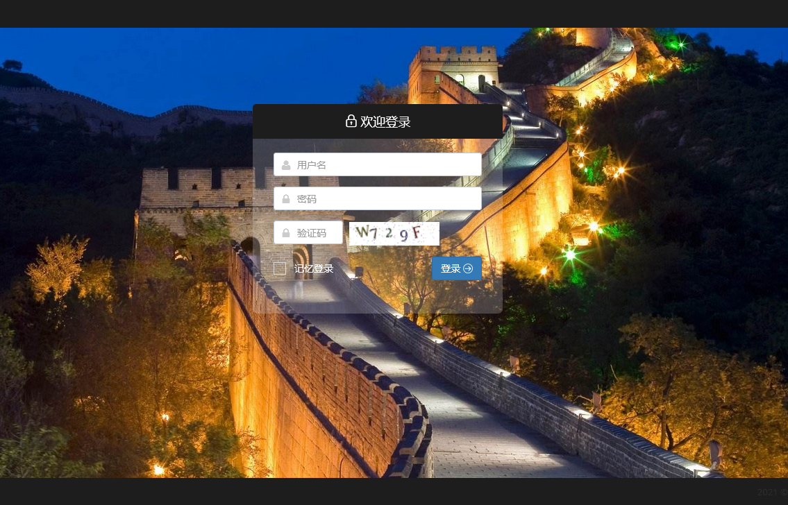

1. 验证码
	验证码主要为防止暴力破解帐户，安全环境下（内网），管理员可以登录后端关闭此项功能，但不建议这样做。
	
2. 记忆登录
- 打勾后系统记录本次登录系统所使用的身份认证，再次访问本系统时，不需要再认证直接登录。
- 在公用电脑使用本系统且不要打勾
- 对于保密性要求比较高的应用，管理员可以登录后台，关闭此功能功，使操作人员每次都强制通过密码认证登录。
- 通过点击：顶层导航|用户菜单|退出，可清除记忆登录。
  
3. 登录密码加密传输，具有防窃听非法盗取。
4. **登录页背景图片设计为自动渐变切换，管理员可以登录后端更换适合不同应用的背影图片。**

我的面板
----------
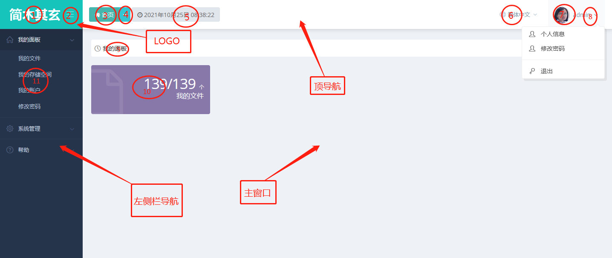

1. LOGO区
- (1)LOGO图标，大小为:160*68px，格式：PNG, 管理员可以通过系统配置来更换此LOGO，以适应不同应用系统定制需求。
- (2)折叠菜单开关按钮，通过此菜单可以开启折叠左栏菜单。

2. 顶导航区
-	(3)点击“首页”可以跳转到前端首页
-	(4)下拉菜单项记录最近操作，点击可快速回到上次操作
-	(5)显示当前服务器时间
-	(6)语言栏：可以切换系统支持语言界面，默认支持简体中文与英语。
- (7)当前登录用户头像，可以通过“我的帐户”来修改。
-	(8)登录帐户菜单栏，包括：“个人信息”、修改密码等菜单项。
	
3. 左侧栏导航区
-	(11)按登录帐户权限以树形菜单形式组织左侧栏导航。

4. 主窗口
-	(9)显示页面当前位置，如：“我的面板”
-	(10)显示具体展现内容，如：我的文件监控信息。

# 我的存储空间
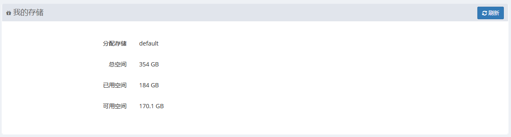

1. 默认存储与WEB储空间共享。

	

# 我的文件

- 本栏目主要实现文件上传，列表分页显示当前登录帐户上传的所有文件，选中单个文件进行编辑、下载等操作，也可以多选后进行批量操作等。
- 文件构织形式采用树型目录。

## 列表
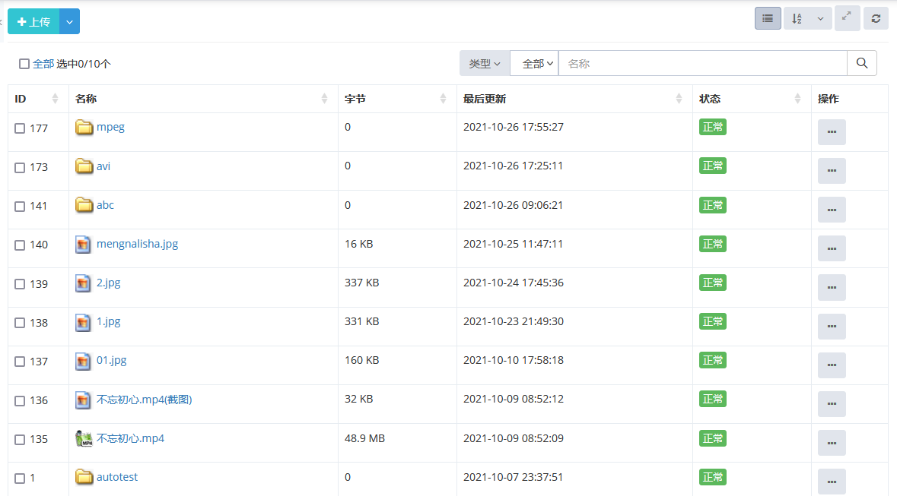

1. 支持多视图：“详细”、“小图标”、“大图标”、“图文”视图展示。
2. 支持按类型、状态、名称查询过滤。
3. 支持按指定字段排序。
4. 支持单选批量选中。
5. 支持图片视频格式幻灯片预览。

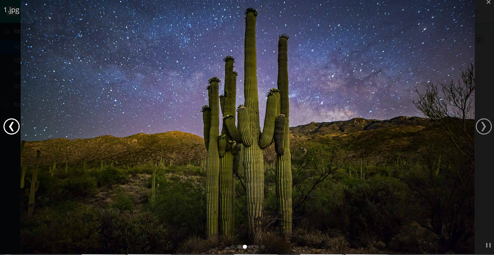

6. 支持操作上下文菜单操作

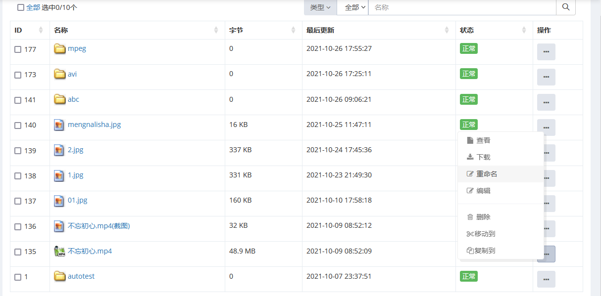

## 上传

- 点击“上传”	选择一个或多个文件实现上传。
- 上传文件类型限制："gif|jpe?g|png|doc|docx|xls|ppt|pptx|xlsx|pdf|txt|zip|tar|gz|bz2|lz|
mp3|mp4|flv|avi|mpeg|ogg|mkv|m4a|rm|rmvb"
- 上传文件大小限制默认为200M，超过200M文件将切换到大文件上传客户端传送。大文件上传客户端下载方法[请点击](#工具下载)
- 上传文件存储在当前登录帐户所分配的存储设备上，未分配设备时，则默认存储在当前服务器上。
- 上传文件默认当前目录，支持用户创建自定义目录。
- 上传的视频类文件系统自动生成视频文件截图,非H5（H264）可播放格式，后端服务将自动产生H5转码视频文件。

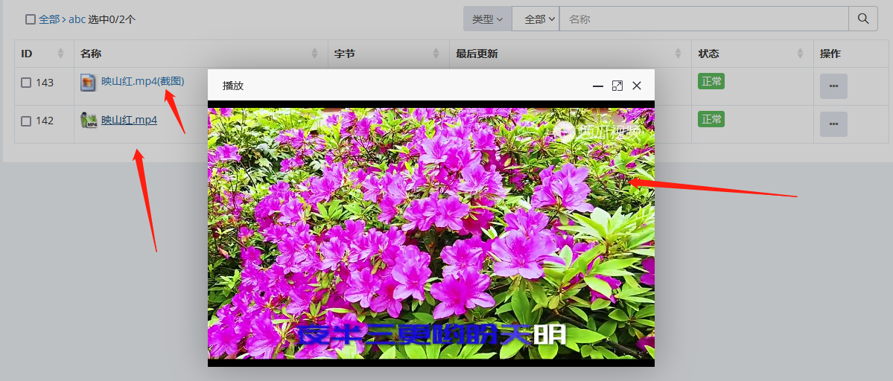

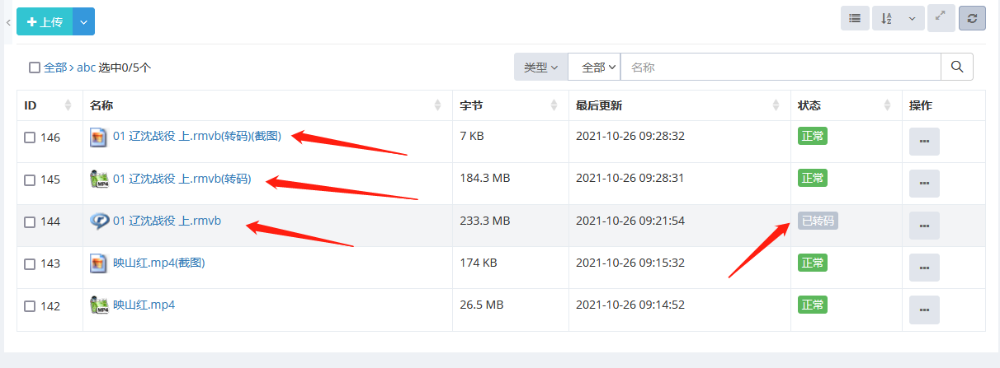

## 转码
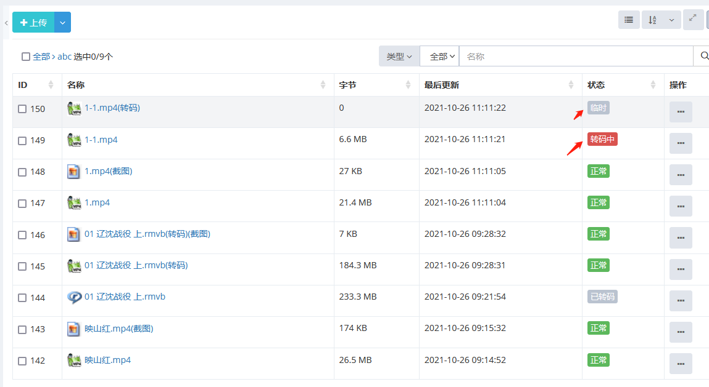

- 视频类文件上传后，后台服务自动开启转码服务，把大多H5不能直接播放的格式转换为能播的格式。
- 视频类文件需要转码时，初始状态为：“待转码”，转码服务启动后，状态切换到：“转码中”，完成后，切换到：“已转码”。
- 支持转码格式：FLV|MPEG|MPEG2|M2P|AVI|RMVB|MKV
- 转码后点击弹出H5播放

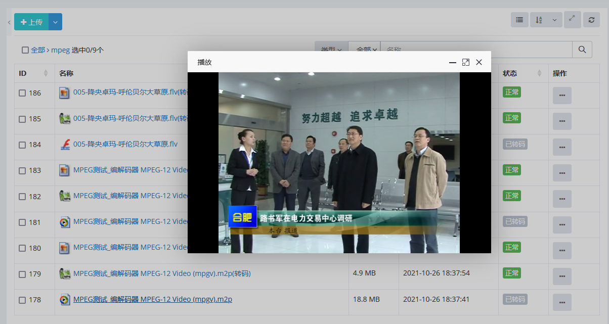

## 创建目录

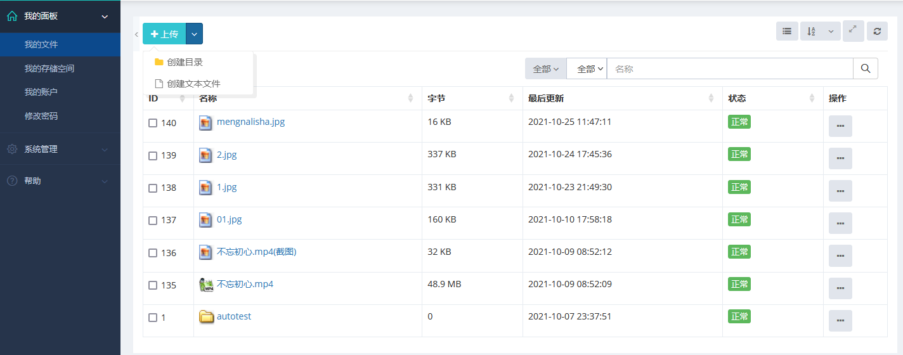

- 点击下拉菜单“创建目录”，输入目录名称，点击“保存”完成目录创建。

## 创建空文件

- 点击下拉菜单“创建文本文件”，输入文本文件名称，点击“保存”完成文本文件创建。
- 注：新创建的文本文件为空，仅占位使用。

## 详细
1. 双击一行或点击上下文菜单“查看”弹出详细

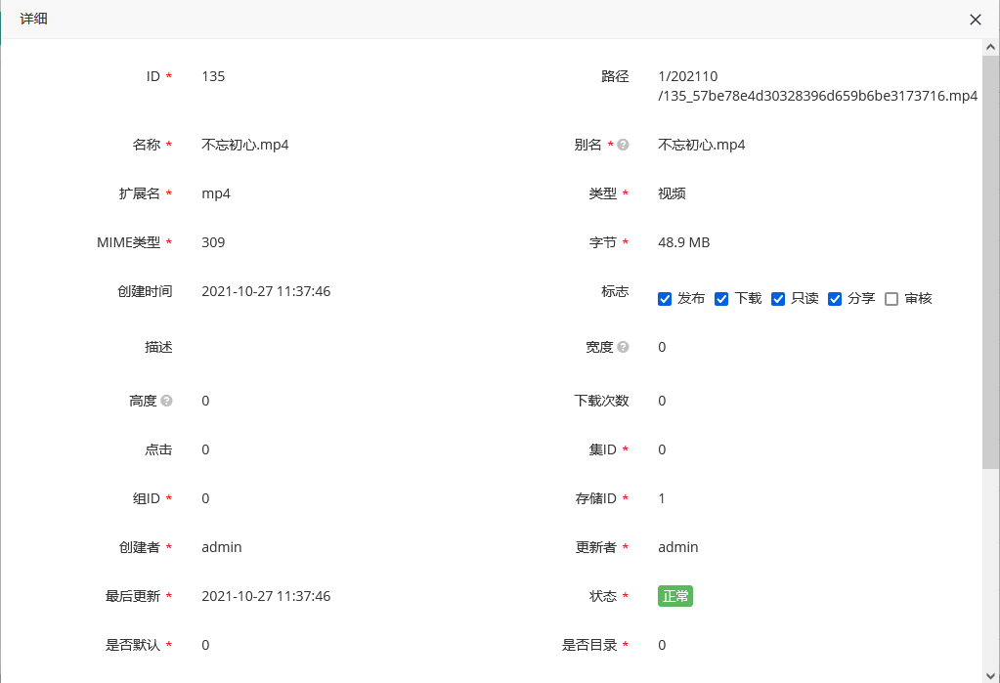

## 编辑
1. 选中一行或点击上下文菜单中“编辑”弹出详细

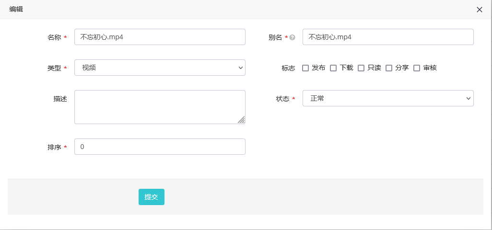

## 下载
1. 点击上下文菜单“下载”下载文件。

## 删除
1. 点击上下文菜单中“删除”弹出删除告警，确认后删除。

## 分享
1. 双击一行或点击上下文菜单“查看”弹出详细，打勾“分享”标志位。
2. 注：发布审核后的文件才会被其他单位看到。

## 发布
1. 双击一行或点击上下文菜单“查看”弹出详细，打勾“发布”标志位。
2. 发布后的文件管理员或单位管理员才能看到。

## 审核
1. 双击一行或点击上下文菜单“查看”弹出详细，打勾“审核”标志位。
2. 审核只能管理员或单位管理员才可以进行审核操作，文件审核后，将不能再编辑。
	

# 我的账户
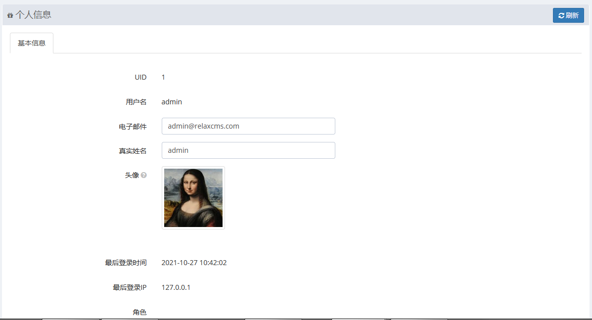

- UID : 帐户唯一标识；
- 用户名: 登录系统使用名称；
- 电子邮件: 帐户绑定的电子邮件；
- 真实姓名: 帐户显示名称，当为空时，显示名称与帐户名称相同;
- 头像: 帐户头像标识，点击更换，支持裁剪;
- 最后登录时间：显示登录本系统最后时间;
- 最后登录IP: 最后登录IP地址;
- 角色：显示帐户角色。

- 个人可以编辑：邮箱、真实姓名、头像，其它字段只读。
- 点击“提交”保存

# 修改密码
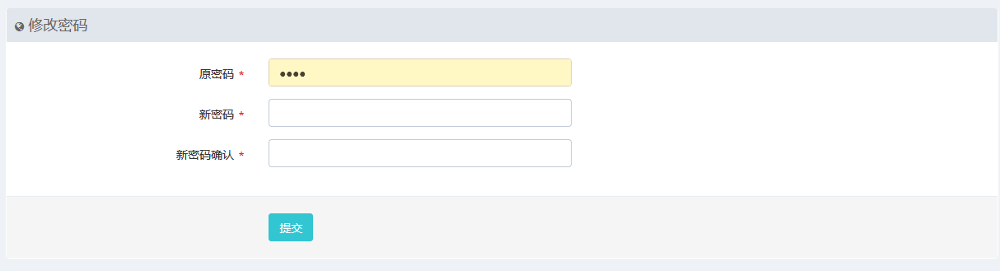

#工具下载
	下载APP客户端、传送客户端、支持H5火狐浏览器等。
	
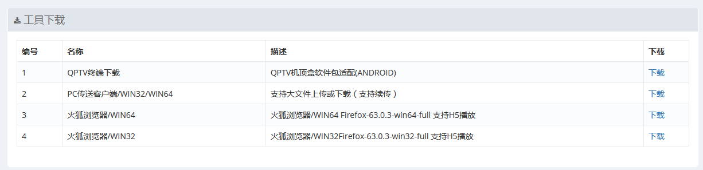
	
