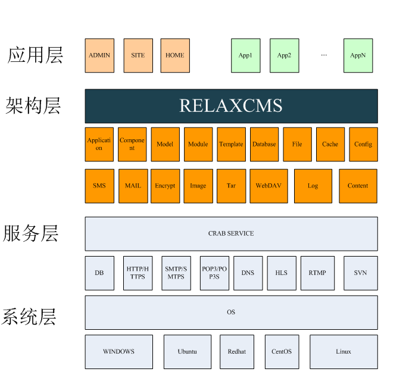
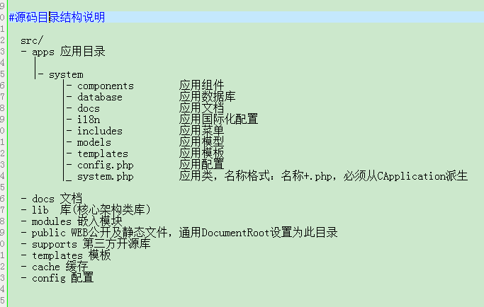

% RelaxCMS简介
% 版本：0.9.1 / 更新时间：2024.1.2

前言
--------

本文主要介绍系统架构、系统特性、开发环境、运行环境、构建编译、模板制作。主要阅读对象为二次开发人员。

*注1：本文档内容依据版本变化将会即时修订，当手册描述与软件实现不一致时，请下载或登录系统查看与软件版本一致的最新手册。*

快速入门
--------
RelaxCMS是一款基于PHP开发的WEB应用框架,主要用于构建WEB应用系统，如：WEB门户、WEB管理系统及API接口等服务系统。

#系统架构

#系统特性
- 跨平台
- 多数据库

	支持：PDO/MYSQL/SQLITE/POSTGRESQL/MONGODB/MSSQL/ORACLE
		
- 多语言
	
	支持多语种国际化：中文（简、繁）、英语等
	
- 可扩展

	支持第三方应用扩展安装。

- 多模板

	支持多模板布局

- 多主题

	支持多主题风格

#开发环境
	PHP/MYSQL
	
#运行环境

	类LAPM集成环境，如LAPM、CRAB; 推荐使用CRAB搭建服务器环境。

#源码下载

- RELAXCMS 官网

		https://www.relaxcms.com
		
- RELAXCMS 官方下载
		
		svn co https://svnproject.relaxcms.com/svn/relaxcms				

- GITHUB下载

		svn co https://github.com/relaxcms/relaxcms.git

#在线演示

		https://demo.relaxcms.com	

#一键安装

-- 支持LINUX环境下一键安装（CRAB+RC），推荐使用Ubuntu 16.04/18.04 Server LTS

		if [ -f /usr/bin/curl ];then curl -sSLO https://www.relaxcms.com/install/install.sh;else wget -O install.sh https://www.relaxcms.com/install/install.sh;fi;bash install.sh
		

-- 注：默认安装RelaxCMS官网发布的最新稳定版本

#一键更新CRAB运行环境

-- LINUX环境下支持一键更新CRAB运行环境(仅更新CRAB)，执行：

		if [ -f /usr/bin/curl ];then curl -sSLO https://www.relaxcms.com/install/updatecrab.sh;else wget -O updatecrab.sh https://www.relaxcms.com/install/updatecrab.sh;fi;bash updatecrab.sh

#一键安装RC

-- 支持LINUX环境下一键安装RC，适合安装好CRAB，还没有安装RC或安装完0.8.14及之前的RC，默认安装到/opt/crab/var/www目录下，执行命令：

		if [ -f /usr/bin/curl ];then curl -sSLO https://www.relaxcms.com/install/installrc.sh;else wget -O installrc.sh https://www.relaxcms.com/install/installrc.sh;fi;bash installrc.sh

#一键更新RC

-- 一键更新RC适用于RC已安装好，想把RC升级到更新版本，不跨版本，如0.9.0.0升级0.9.0.123，可以在RC的安装目录下，如：/opt/crab/var/www执行以下一键更新RC命令：

		if [ -f /usr/bin/curl ];then curl -sSLO https://www.relaxcms.com/install/updaterc.sh;else wget -O updaterc.sh https://www.relaxcms.com/install/updaterc.sh;fi;bash updaterc.sh

-- 注：一键更新RC,须在RC部署目录下执行

#一键升级RC

-- 一键升级RC适用于RC已安装好，想把RC升级到更新版本，可跨版本，如0.9.0.0升级0.10.0.123，可以在RC的安装目录下，如：/opt/crab/var/www执行以下一键升级RC命令：

		if [ -f /usr/bin/curl ];then curl -sSLO https://www.relaxcms.com/install/upgrade.sh;else wget -O upgrade.sh https://www.relaxcms.com/install/upgrade.sh;fi;bash upgrade.sh

-- 注：一键升级RC,须在RC部署目录下执行
-- 注：等同RC的安装目录/opt/crab/var/www/bin下执行: ./upgrade.sh (版本：0.9.0以上)
			

#快速安装

-- 从RelaxCMS官网下载RelaxCMS 最新版本，如：https://www.relaxcms.com/f/35/relaxcms-0.8.14.962.tar.gz

-- 从RelaxCMS官网下载运行环境CRAB: 

	LINUX版本：crab-<VERSION>-x86_64.tar.gz，下载后，解压安装，./setup.sh命令安装。
	
	WINDOWS版本：crab-<VERSION>-win32.exe，下载后，点击安装，开发调试使用，生产环境不建议用。

#源码目录结构说明

	src/
	- apps 应用目录
	  |
	  |- system                 
	       |- components        应用组件
	       |- database          应用数据库 
	       |- docs              应用文档
	       |- i18n              应用国际化配置
	       |- includes          应用菜单
	       |- models            应用模型
	       |- templates         应用模板
	       |- config.php        应用配置
	       |_ system.php        应用类，名称格式：名称+.php，必须从CApplication派生
	       
	- docs 文档
	- lib  库(核心架构类库）
	- modules 嵌入模块
	- public WEB公开及静态文件，通用DocumentRoot设置为此目录
	- supports 第三方开源库
	- templates 模板
	- cache 缓存
	- config 配置
	
	

	
	
  